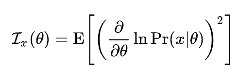

Overcoming catastrophic forgetting in neural networks (EWC) 논문을 읽다가 Fisher information matrix를 활용한 loss function을 접하게 되었다. 하지만 FMI의 의미를 명확하게 설명해주는 자료를 찾지 못한것 같아 정리해보고자 한다. (증명은 많은데 정확히 의미하는 바를 알 수 없었다 😂)

검색해보면 위키피디아에 설명이 쭉 나오는데 아래와 같은 정보로는 정확한 의미를 이해하기엔 무리였다.

> 확률변수 가 미지의 매개변수 로 주어지는 분포를 따른다고 하자. 그렇다면, 관측값 으로부터 주어지는, 에 대한 **피셔 정보** 는 다음과 같다.

가장 큰 도움을 받은 자료는 9년전 업로드 된 [유튜브링크](https://www.youtube.com/watch?v=m62I5_ow3O8&ab_channel=jonathanpober) 였고, likelihood function으로 부터 차근차근 의미를 살펴본다.

* Fisher information이 크다

  = more curved

  = more peaky 

  = more constraining data (in particular parameter)

[jekyll-docs]: http://jekyllrb.com/docs/home
[jekyll-gh]:   https://github.com/jekyll/jekyll
[jekyll-talk]: https://talk.jekyllrb.com/

