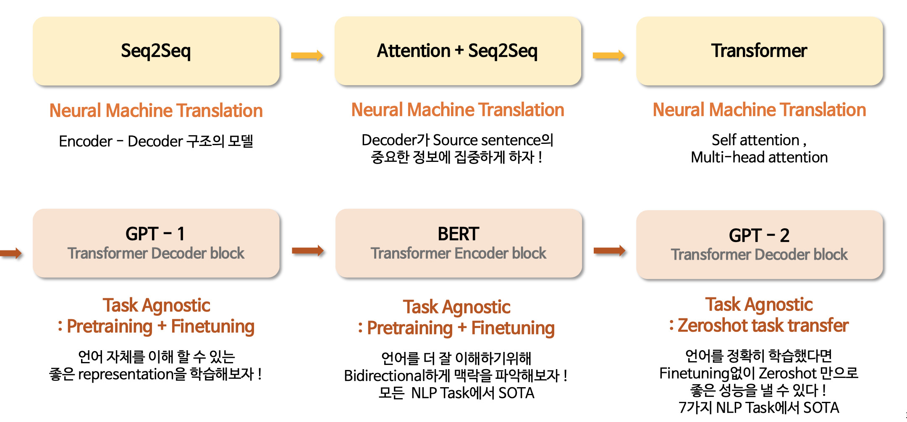
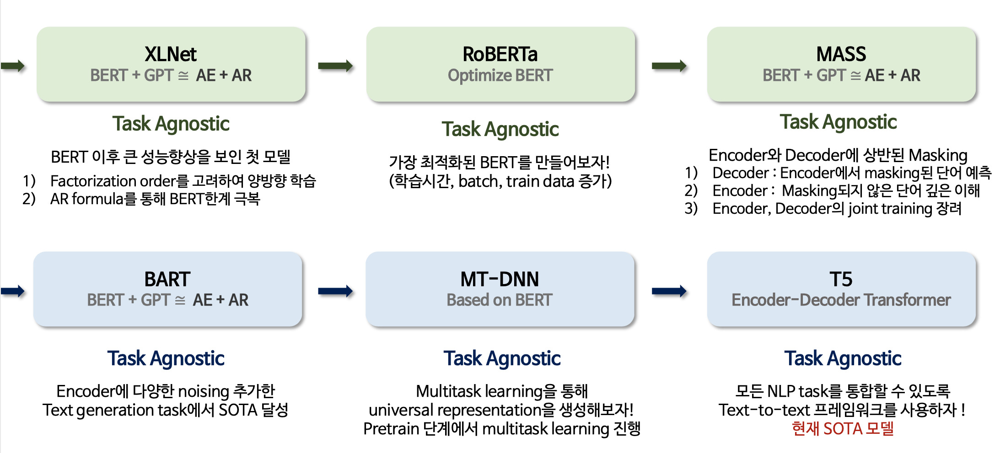

 학부 졸업 프로젝트와 논문이 Object detection과 Linear Proramming을 주제로 했기 때문에, 연구실 지원당시에도 NLP를 공부할것이라 미처 생각하지 못했다.  그래서 입학이 확정난 이후부터 스터디를 하면서 기본개념부터 BERT model까지 공부를 진행했다. 

 특히 Transformer model을 이해하는것에 많은 시간을 투자했는데, 그 이후로도 많은 모델이 쏟아져 어떤것을 공부해야하는지 갈피를 잡지 못했다. 시간이 조금 지나고나니 막막함이 사라졌고, 이 기회에 BERT 이후로 등장한 Transformer류 모델들을 묶어서 정리해봐야겠다고 생각했다. 비슷한 궁금증을 가진 분들께 도움이 되길 바란다.

본 포스팅에서는  **XLNet, RoBERTa, MASS, BART, MT-DNN, T5** 의 6가지 모델에 대해 설명을 진행한다. 

## Introduction

NLP모델의 큰 흐름을 정리해보면 Task specific model이 제안되다가 Transformer를 기점으로 Task Agnostic(Task에 상관없는) model이 쏟아지고있다. 즉, 대용량 데이터로 학습한 pretrained model이 대부분의 downstream task에서 좋은 성능을 내기 시작했다는 것을 알 수 있다.

####1) Seq2Seq ~ GPT 2

먼저 GPT2가 나올때 까지 흐름을 살펴보면, Encoder-Decoder형태로 구성된 Seq2Seq모델과 attention이 만나 강력한 모델이 나왔고, 그 이후로 Self-attention이 제안되면서 Transformer가 등장했다. Transformer Decoder로 구성된 모델이 GPT, Encoder로 구성된 모델이 BERT이다. 

**GPT-1**의 핵심은 대용량의 데이터를 학습하여 '언어 자체'를 잘 이해할 수 있는 representation을 학습하는것이다. Transformer의 DecoderVision에서 대용량의 이미지 데이터를 학습해서 pretrained model을 생성하였고, downstream task에서 좋은 성능을 보였기 때문에 NLP도 비슷한 연구 흐름을 따라갔다고 이해할 수 있다. 

그 다음에 제안된 논문은 **BERT**이다. BERT는 Text를 Encoding할 때 단방향 학습(Unidirectional learning)이 가지는 단점을 지적하며 주변 단어를 한번에 학습 할 수 있는 Bidirectional 구조를 제안한다. 이 구조가 가능한 이유는 BERT의 목적함수 때문인데 아래에서 특징을 살펴보려한다. BERT는 발표당시 모든 NLP TASK (Benchmark dataset에 있는)에서 SOTA를 달성했다. (2019년 9월에 입학해서 그 당시 BERT모델이 얼마나 큰 위력을 가진지 크게 체감하지 못했었다) 추가적으로 BERT의 중요한 특징 중 하나는 Multilingual능력인데, 기회가 된다면 이 부분에 대해서도 정확히공부 해볼 생각이다.

**GPT-2** 는 Original GPT의 성능을 끌어올린 모델이다. GPT-1을 통해 Transformer Decoder만 사용하는 경우 좋은 성능을 달성할 수 있다는 것을 증명했고, 더 많은양의 데이터에 더 오래 학습했을 때 얼마나 더 좋은 성능을 보여줄 수 있는지 알려주었다. 실제로 논문을 읽어보면 모델 구조에 대한 변화 없이 여러가지 task를 하나의 모델로 학습하면 (논문에서는 multi-task를 처리해서 general system을 만들겠다 라고 표현한다) Zero shot에서도 높은 성능을 보일 수 있음을 실험적으로 보여주었다. 여기서 말하는 multi-task의 objective는 아래와 같이 표현할 수 있다.
$$
p(output \mid input, task)= p(output \mid answer the qustion, document, question, answer)
$$

####2) XLNet ~ T5

오늘 소개할 예정인 6가지 모델은 BERT이후에 뚜렷한 성능 향상을 이루어낸 논문들이다. 특히 XLNet이 나오기전까지 두드러진 성능향상을 보인 논문이 없었다. 아래에 각 논문의 방법론을 자세히 다룰 예정이므로 간략히 정리해보았다.

**XLNet** Bert와 GPT가 좋은 성능을 보였다면 두 모델을 다시 합칠 때 더 좋은 성능이 도출 될 것이라 기대해볼 수 있다.Encoder는 BERT를 Decoder는 GPT의 형태를 가진 모델이 XLNet이다. 하지만 두개의 모델을 단순히 Attention 연산으로 결합한 것이 아니기 때문에 새로운 목적함수와 학습 방법에 집중해야하는 모델이다. 특히 논문의 흐름과 구성이 매우 좋은데(역시 구글 !), 각 모델의 장점을 극대화하고 단점을 극복하는 연구의 흐름이 흥미로웠다.

**RoBERTa** 는 최적화된 BERT라 요약할 수 있다. 공개된 BERT가 여전히 underfitting되었다는 문제를 제기하며 학습데이터를 추가하고, 학습시간을 증가시켜 Robust한 BERT를 만들었다.

**MASS**는 추후 연구에서 자주 등장하지 않는 모델이지만 BERT와 GPT를 결합했다는 면에서 선택하였다. 특히 여기서는 Encoder와 Decoderd에 상반된 masking을 진행하는데, 이러한 방법이 Encoder와 Decoder의 joint training을 가능하게 한다. (BART도 masking을 다르게 하는 모델인데 두가지를 비교하면서 보면 좋을 듯 하다)

**BART** 또한 BERT와 GPT함께 사용하는 모델이다. 하지만 MASS와 다르게 Encoder에 다양한 Noise를 추가하여 좋은 성능을 기록하였다. 특히 summarization에서 좋은 성능을 보였다고 알려진 모델이다. 

**MT-DNN** 은 기존의 Language 모델과 결이 다르지만 BERT를 베이스로 Multi task learning을 진행한 모델이다. NLP에 다양한 Task를  pretrain단계에서 학습하여 General한 성능을 높이고자 하는것이 아이디어이다. (내가 생각할 때 )이 논문이 중요한 이유는 두가지로 요약할 수 있다. 

1) 최근까지 연구 방향은 더 높은 성능을 보이는 Language model을 제안하는것에 초점이 있었으나 단일모델로 Multi task를 연구하는 새로운 흐름을 제안함

2) GPT2가 제안될 때 언급한 'general system'에 대한 방법론을 구체적으로 제안한 모델

**T5** 논문은 GPT3가 나오기 이전까지 SOTA를 기록한 모델이다. 정확한 풀네임은 Text to text transfer transformer이다.  basic transformer encoder-decoder를 적용한 모델이기에 BERT와  GPT를 쌓았던 기존 모델과는 또 다른 모습을 보여준다.  이 모델도 General한 LM을 만들기 위해 단일 모델이 multi task learning을 진행한다. 하지만 기존의 모델과 다른점이 있다면 (MT-DNN은 task마다 독립적인 loss가 존재하기때문에 Hard multi task learning으로 분류된다) 동일한 loss와 hyperparameter를 사용하여 학습을 진행한다. 

내용이 매우 길어질것으로 예상되어 포스팅을 나누어 진행할 예정이다. 

이미 연구실 세미나에서 진행했기 때문에 영상과 자료는 아래의 링크에서 확인할 수 있다.

> 유튜브 영상 : [LINK](https://youtu.be/v7diENO2mEA)
>
> 자료 : [LINK](http://dsba.korea.ac.kr/seminar/?mod=document&uid=247)
>
> pdf 자료가 연구실 홈페이지에 공개되어있지만 (감사하게도) 메일로 ppt 파일을 요청해주시는 분들이 있다.
>
> 따라서 ppt파일이 필요한 분들은 연구실에 기재되어있는 메일로 연락주시면 된다 🤩

[jekyll-docs]: http://jekyllrb.com/docs/home
[jekyll-gh]:   https://github.com/jekyll/jekyll
[jekyll-talk]: https://talk.jekyllrb.com/

