 

본 포스팅에서는  **XLNet, RoBERTa**에 대한 설명을 진행하며, 특히 XLNet을 중점으로 소개한다. 

## Introduction

 지난 포스팅에서 살펴본 바와 같이 Pretrained model이 대부분의 NLP task에서 좋은 성능을 보이기 시작하면서 transformer 구조를 활용한 여러가지 모델이 제안되었다. Transformer Decoder구조를 활용한 GPT, Encoder구조를 활용한 BERT가 있었고 Encoder-Decoder를 합친 모델들이 제안되었다. 좋은 모델을 합쳐 더 좋은 모델을 만들겠다는 아이디어는 당연한 흐름으로 볼 수 있지만, 사실 이러한 모습은 Vanila transfomer와 동일한 구조를 다시 따라갔다고 볼 수 있다. (물론 학습과정이나 objective의 차이는 존재한다)

 XLNet 논문은 굉장히 잘 쓰여진 논문 중 하나라 생각하는데, 그 이유는 언어모델의 Pretraining의 대표적인 objective를 정리하고 XLNet의 아이디어가 도출된 흐름을 매우 논리적으로 보여주기 때문이다. 

#### 1. Pretraining의 대표적인 Objective

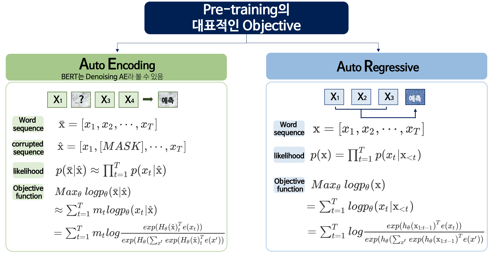

 Language model은 크게 두개의 대표적인 Objective 를 가지고 있다. 

#### 1.1 AutoEncoding

우리가 알고있는 Auto Encoding은 input 값을 그대로 복원해 내는것이 목적이다. 하지만 엄밀하게 말하면 BERT의 경우 노이즈가 첨가된 Input값을 노이즈가 없는 값으로 복원하는 것이며, Denoising AutoEncoding을 진행한다.  Word Sequence가 다음과 같이 주어져있을 때 일정확률로 단어에 noise를 줄 수 있다. BERT에서는 특정 단어(혹은 토큰)을  `[MASK]` token으로 치환한다. 전체 단어 corrupted sequence가 조건으로 주어져 있을 때 정상적인 word sequence가 나올 확률을 Likelihood로 볼 수 있으므로 objective function은 아래와 같다 

수식에서 등장하는 $m_t$는 $t$ 번째 token의 masking 여부를 나타낸다 (binary)

$$
Max_\theta log p_\theta(\mathbb{\bar{x}} \mid \mathbb{\hat{x}})\\
\approx \sum_{t=1}^T m_tlogp_{\theta}(x_t \mid \mathbb{\hat{x}})\\
=\sum_{t=1}^Tm_tlog\frac{exp(H_\theta(\mathbb{\hat{x}})_t^Te(x_t))}{exp(H_\theta(\sum_{x'}exp(H_\theta(\mathbb{\hat{x}})_t^Te(x'))}
$$

#### 1.2 AutoRegressive

AutoRegressive는 기존의 LM이 가지는 일반적인 Objective이다. 기존의 단어 시퀀스 조건 하에 가장 높은 등장 확률을 가지는 단어를 예측하는 방식이다. 따라서 아래의 식으로 표현할 수 있다.

$$
Max_\theta log p_\theta(\mathbb{x})  \\
= \sum_{t=1}^T logp_{\theta}(x_t\mid \mathbb{x}_{<t})\\
=\sum_{t=1}^Tlog\frac{exp(h_\theta(\mathbb{x}_{1:t-1})^Te(x_t))}{exp(h_\theta(\sum_{x'}exp(h_\theta(\mathbb{x}_{1:t-1})^Te(x'))}
$$

하지만 각각의 objective function은 몇가지 문제점을 가지고 있다.

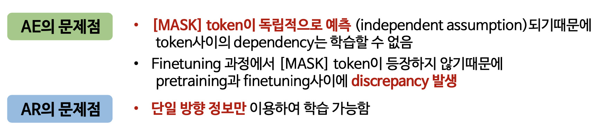

 먼저 AE는 MASK 토큰으로 부터 생기는 문제점이 있다. BERT가 Pretraining을 진행할 때 (MLM objective) text에서 random하게 15%의 token을 `[MASK]` 로 치환하고, 각 `[MASK]` token을 독립적으로 예측한다 (**objective 식의 조건부 확률 식을 보면 masking된 token을 독립이라 가정하고있다 = 결합확률을 구하기위해 각 확률을 모두 곱한다 **). 이 말은 mask  token을 예측 할 때 각각의 dependency를 학습할 수 없다고 이해할 수 있다. 또한 `[MASK]` 토큰은 pretraining 단계에서만 등장하기때문에 pretraining과 finetuning 사이에서 discrepancy(불일치)가 발생할 수 있다.

AR은 기존의 단어를 조건으로 다음 단어를 예측해야하기때문에 단일 방향 정보만 이용할 수 있다는 치명적인 단점을 가지고 있다. 논문에서는 이를 'Context dependency'가 부족하다고 표현한다.

기존의 Objective 의 장점을 모두 활용하고, 각각의 문제점을 보완한 모델이 **XLNet** 이다. 

#### 2. XLNet

XLNet 논문을 읽은 후에 Transformer XL도 읽어보았는데 조금 더 긴 길이의 text를 고려하기위해 제안된 모델이다. 정확하게 이해를 하기위해서는 두가지 논문을 다 읽어보는것이 좋지만, 핵심 아이디어들은 XLNet을 설명하면서 포함할 수 있을것이라 생각한다. (하지만 공부하면서 따로 정리해둔 자료가 있어 추후 포스팅 형태로 재구성할 예정이다 😉)

#### 2.1 Permutation Language Modeling Objective

기존의 모델은 양방향을 고려하지 못했고, `MASK` 토큰을 가지고 있으니 이 문제를 해결하기 위해서는 새로운 objective function이 필요하다. 

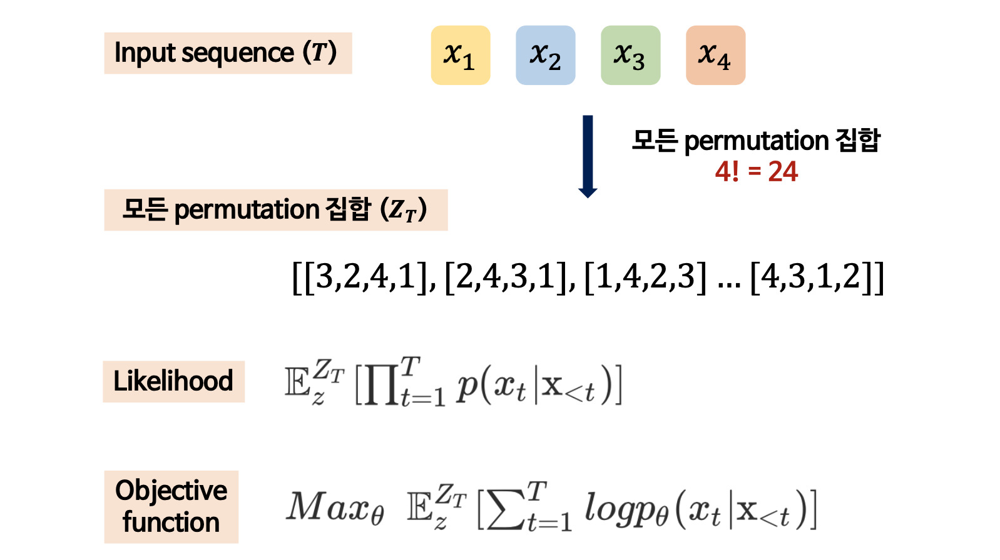

가장 눈에 띄는것은 `[MASK]` 토큰이 사라졌다는 사실이다. context를 고려해주기위해 permutation을 진행했으며 모든 permutation 집합을 구해 $Z_T$를 생성한 후 AR fomula에 대입하여 최종 objective function을 구성한다. 정리해보자면, **Permutation  집합을 통해 다양한 sequence를 고려** 하고, **AR Objective function**에 대입하여, **특정 토큰에 양방향 Context를 고려** 할 수 있게되었다. 

예시를 들어 설명하면 아래와 같이 표현할 수 있다. 

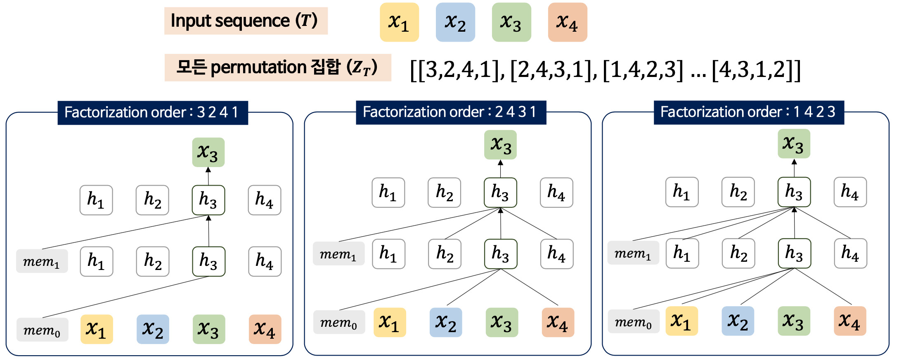

$x_3$을 예측하기 위해 모든 permutation 집합에서 $x_3$이 등장하는 정보를 얻을 수 있게되며 이 과정을 통해 양방향 context를 고려할 수 있다고 한다 ( 하지만 논문을 읽으면서 무작위로 생성한 permutation 집합이 과연 효과가 있을까 고민을 하게됐었다. 페이스북이나 레딧에 올라오는 글들을 보면 permutation 이 XLNet의 성능 향상에 큰 기여를 하지 않았다는 주장이 많고, 이를 부정적으로 바라보는 시각이 많다고하는데 막상 검색해보니 정확한 출처는 찾지 못했다 (?!) ) max length를 512라 생각하면 permutation 집합의 수가 너무 많아져서 계산상 문제가 생길거라 생각했는데, 실제 코드를 확인해보니 sampling해서 진행하고있었다.

#### 2.2 Target-Aware Representation for Transformer

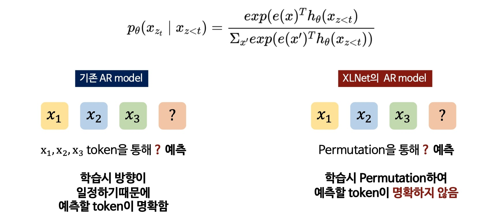

새로운 objective function은 기존의 transformer에서 작동하지 않는데, 이를 위해 Target-Aware Representation 이 제안되었다.  기존의 방법론은 permutation을 진행하지 않고 다음 토큰을 예측하기때문에 문제가 없었지만, permutation을 진행하게되면 위치정보가 뒤섞이기때문에 어떤 토큰을 예측해야하는지 명확해지지 않는다는 문제가 생긴다. 

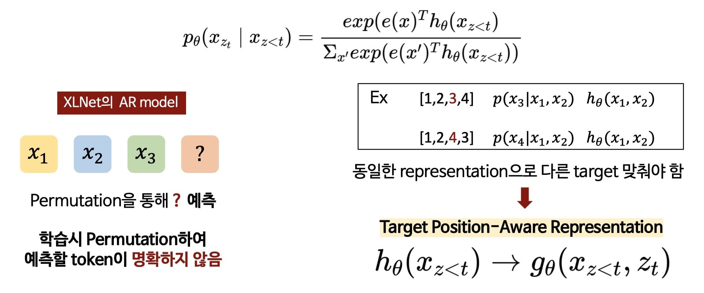

따라서 위치 정보를 함께 고려해줄 수 있는 position aware representation이 필요한데, 새로운 representation은몇번째 토큰이 target인지 알려준다. 

#### 2.3. Two-stream Self-Attention

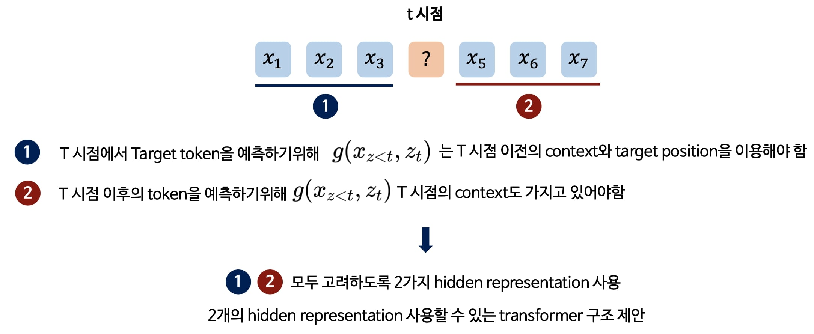

새로운 representation을 구했다면 Self attention연산을 진행해야한다. 하지만 몇가지 문제점이 있다. 어떤 sequence에서 $t$ 시점에 있다 생각해보자. 먼저 $t$ 시점에서 Target 토큰을 예측하기위해서 representation $g(x_{z<t},z_t)$는 $t-1$ 시점 까지의 context와 target position 정보가 있어야한다. 하지만 $t$ 시점 이후의 토큰을 예측하기위해서는 t 시점의 context도 가지고 있어야한다 ! 이 두가지를 한번에 만족할 수 없기 때문에 2가지 hidden representation을 사용하며, standard transformer는 두개의 hidden representation을 사용할 수 없어서 새로운 transformer 구조를 제안한다. (standard transformer는 하나의 token이 하나의 representation을 만들어내기때문!) 

#### 1) Query representation

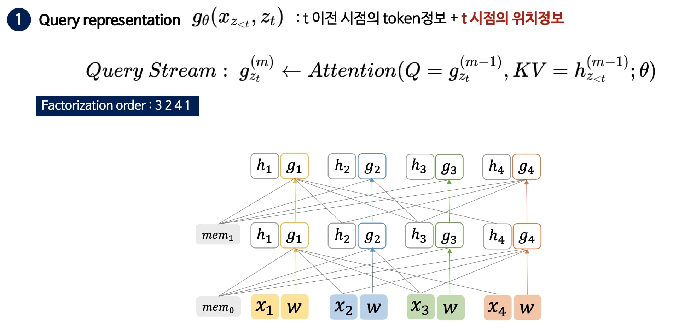

각 Q,K,V에 어떤값이 들어가고 어떤식으로 Attention이 구성되는지 보는게 중요하다. Factorization order가 3,2,4,1 로 구성되었을 때 각 position이 어떤 정보를 통해 representation을 구성하는지 확인해봐야한다. 여기서 생성하고자 하는 것은 Query representation인 $g_\theta$ 이다.

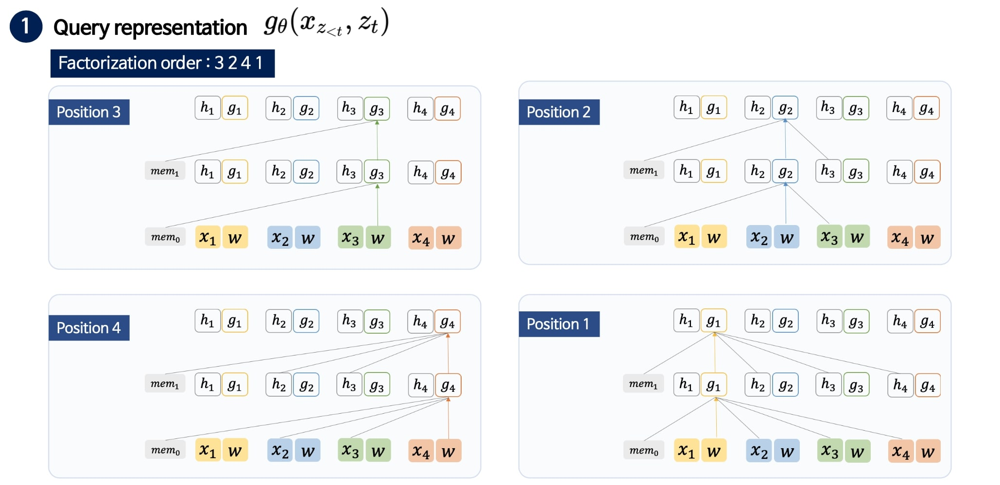

* Position 3 : 3
* Position 2 : 3 - 2
* Position 4 : 3 - 2 - 4
* Position 1 : 3 - 2 - 4 - 1

각 position의 $g$ 값을 만들기 위해 어떠한 정보가 활용되는지 봐야하는데 그림에서 보이는 $w$ (첫번째 층에서 나오는 $g$)는 trainable parameter이다  

#### 2) Context representation 

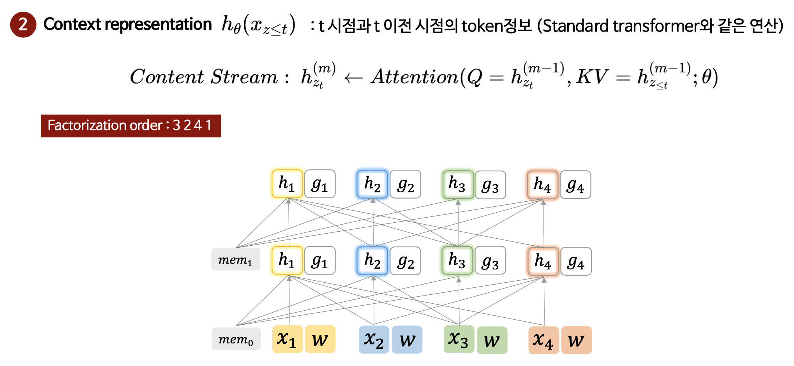

사실 context representation은 standard transformer와 같다. 

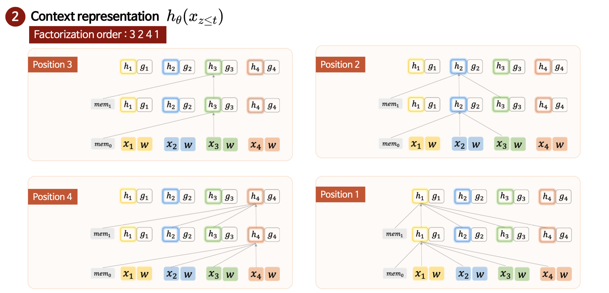

그림에서 보이는 $w_t$ (첫번째 층에서 나오는 $h$)는 word embedding 값을 사용한다  

새로운 모델 구조와 representation을 제안하는 목적은 BERT보다 더 많은 dependenct를 고려할 수 있다는 말과 같다 (논문에서는 'The dependency can only be covered by XLNet but not BERT')

#### 2.4 추가 설명

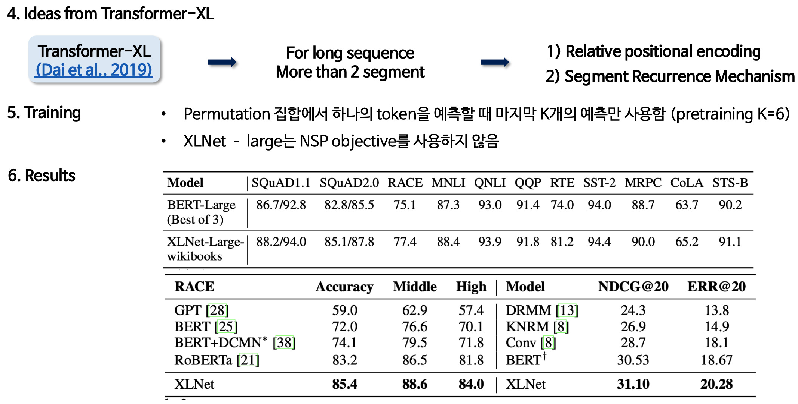

 XLNet이 transformer XL로부터 영감을 얻은 모델이기때문에 long sequence를 다루기위해 Relative positional encoding과 Segment Recurrence Mechanism을 적용했다는 설명이 나온다. 아주 간단히 짚고 넘어가면, 기존 모델이 max length 안에서만 학습을 진행했다면 Transformer xl은 더 많은 정보를 고려하여 학습을 진행하기위해 전체 문서를 segment 단위로 잘라서 학습을 진행하고, cache memory 형태로 저장하여 새로운 segment를 계산할 때 첫번째 segment의 정보를 활용하여 학습을 한다 (그래서 위 그림에 memory를 의미하는 mem 이 속해있다) 이런 방법으로 학습을 하면 더 긴 길이의 데이터에 강건한 모델을 만들 수 있다고 한다. 

또한 Permutation 집합에서 마지막 K개의 예측만 사용하여 학습을 진행한다고 하는데, 앞서 언급했듯 샘플링해서 학습을 진행했다.

추가적으로 XLNet large model은 NSP objective를 사용하지 않았으며 실험 결과를 보면 기존 모델보다 성능이 향상된것을 알 수 있다.

#### 3. RoBERTa

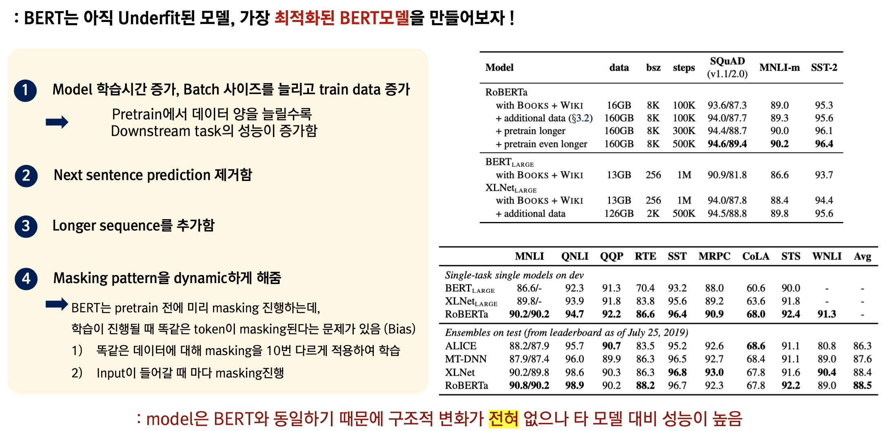

RoBERTa는 아주 간단히 정리가 가능하다. 그 이유는 모델의 구조가 BERT와 완전히 동일하기 때문이다. BERT가 underfitting되었기 때문에 더 강건한 BERT를 만드는것이 목적이며, NSP objective를 제거하여 학습을 진행했다. (이는 NSP Objective가 성능에 큰 영향을 미치지 않기 때문이라 기술하였고, 추후 연구들에서도 NSP를 제거하는 추세이다) 또한 길이가 긴 데이터를 추가하여 학습했고, Masking을 보다 dynamic하게 만들어서 unbiased masking을 통해 성능을 높였다 (노이즈가 생성될 토큰을 다양하게 만들었다고 생각하면 된다.)

이미 연구실 세미나에서 진행했기 때문에 영상과 자료는 아래의 링크에서 확인할 수 있다.

> 유튜브 영상 : [LINK](https://youtu.be/v7diENO2mEA)
>
> 자료 : [LINK](http://dsba.korea.ac.kr/seminar/?mod=document&uid=247)
>
> pdf 자료가 연구실 홈페이지에 공개되어있지만 (감사하게도) 메일로 ppt 파일을 요청해주시는 분들이 있다.
>
> 따라서 ppt파일이 필요한 분들은 연구실에 기재되어있는 메일로 연락주시면 된다 🤩

[jekyll-docs]: http://jekyllrb.com/docs/home
[jekyll-gh]:   https://github.com/jekyll/jekyll
[jekyll-talk]: https://talk.jekyllrb.com/

