 

본 포스팅에서는  **MASS, BART**에 대한 설명을 진행한다.

## Introduction

 지난 포스팅에 이어서 Transformer 기반 모델 2가지에 대해 살펴보려한다. MASS, BART는 사실 엄청나게 리뷰가 많은 모델은 아니지만 (처음 자료를 제작하던 시기에는 MASS나 BART로 검색하면 관련 자료가 정말 없었는데 요즘은 많이 늘어났다 !) 여러가지 논문을 이해하기위해 필요하다 생각하였다. BERT의 큰 성공요인중 하나가 MLM이기때문에 BERT 이후의 모델들은 다양한 masking 방법을 시도했다. 오늘 소개할 두가지 논문도 비슷한 흐름을 따르며, 모두 좋은 성능을 보였기 때문에 두가지 모델의 masking 방법을 비교하면 흥미로울것이라 생각한다. 

#### 1. MASS

 *포스팅을 위해 MASS 논문을 다시 읽게 되었는데 MASS의 Introduction이 매우 합리적이라 느꼈다. Language Generation을 위해 BERT 와 같은 pre-training 방법을 가진 모델은 infeasible 하기 때문에 MASS가 새로운 Masking 방법을 제안했고, Encoder-Decoder가 함께 학습될 수 있도록 강제한 것이 인상적이었다. 실제로 자료와 영상에 MASS의 비중을 낮게 설정하였는데, Transformer 기반 모델이 발전하는 과정을 보여주는 중요한 다리 역할을 한다고 생각한다.*

>  *Directly applying a BERT like pre-training method on these natural language generation tasks is not feasible, since BERT is designed for language understanding, which are usually handled by just one encoder or decoder.*

MASS는 Microsoft에서 제안한 모델로, 풀네임은 Masked Sequence to Sequence Pre-training for Language Generation이다. 모델의 이름에서 바로 목적을 캐치할 수 있다. **Masked sequence to sequence** 를 통해 기존에 두가지를 유추해 볼 수있다.

1) 이 모델은 Sequence to Sequence구조를 가질것

2) Seq2Seq에 masking을 진행할것

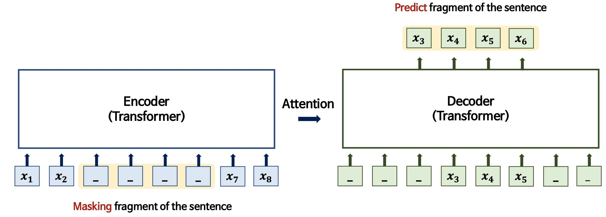

 실제로 MASS의 구조는 유추한 대로 구성되어있다. Transformer기반의 Encoder-Decoder가 연결되어있고, Masking이 Encoder와 Decoder에 모두 들어가있다. 논문에서 지속적으로 언급되는 단어가 있는데, 바로 'fragment'라는 단어이다. **sentence의 fragment 단위로 masking을 진행**하는것이 MASS의 포인트이다. 추가적으로 Encoder에서 masking한 token을 제외한 나머지 token이 Decoder의 mask token이 된다. 

이렇게 학습하게되면 Decoder가 sentence의 fragment를 예측할 때 Encoder에 의존하게 강제 할 수 있고, 이러한 특징이 Encoder-Decoder가 joint training을 하도록 돕게된다. 

Autoregressive한 구조의 모델은 next token prediction을 진행할 때 대부분 decoder의 previous token에 영향을 많이 받게 된다. 하지만 MASS 의 구조를 사용하게 되면 보다 source representation에 의존할 수 있게 되며, 이 점이 MASS의 contribution중 하나이다.

모델에서 Masking 방법을 다르게 설정하겠다는 의미는 **Objective function이 변화**한다는 것과 같다. 

*지난 포스팅에서 이미 언급했지만 다시한번 objective function을 정리해보자 (MASS 논문에관련 내용이 잘 정리되어있다.)*

#### 1.1 Sequence to Sequence Learning

$$
L(\theta ; (\mathcal{X},\mathcal{Y})) = \sum_{(x,y) \in (\mathcal{X},\mathcal{Y})}log(P(y\mid x \ ; \theta))
$$
기본적으로 Seq2seq은 주어진 token을 기반으로 그 다음 token이 등장할 확률을 가장 높이는 parameter $\theta$ 를 학습한다.  **주어진 token을 기반으로 그 다음 token이 등장할 확률** 을  나타내기 위해서 Conditional probability를 사용하게되므로  log likelihood를 적용하였을때 위의 식으로 나타낼 수 있다.

$$
P(y\mid x \ ; \theta) = \Pi_{t=1}^{n}P(y_t\mid y_{<t}, \ x \ ; \theta)
$$
Conditional probability $P(y\mid x \ ; \theta)$ 는 Chain-rule 에 따라 위와 같은 식으로 factorize 할 수 있다. 일반적으로 우리가 아는 Sequence to sequence model의 objective function이다.  

#### 1.2 MASS

저자들은 MASS의 방법론을 'unsupervised prediction task' 라고 정의내렸다. 새로운 masking 방법을 제안했기 때문에 새로운 objective function formulation 에 초점을 맞추어 설명 해보려한다.

* Source sentence : $x$,  $x \in \mathcal{X}$
* masked fragment of sentence :  $x^{ \backslash u:v}$ 
* Fragment of sentence :  $x^{ u:v}$ 

크게 세가지 정의가 필요하다. input이 되는 sentence를 $x$ 로 정의했고, 그 안의 token들을 나타내기 위해 $x^m$ 의 형태로 나타낸다. u~v는 fragment의 시작과 끝을 나타내는 index로 이해하면 된다

* number of tokens of sentence $x$ : $m$ , $0<u<v<m$
* number of tokens being masked : $ k$ , $k = v-u+1$

나머지 정의들은 다음과 같고, MASS에서 새로 정의된 objective function (log likelihood)은 아래와 같다.
$$
L(\theta ; (\mathcal{X})) = \frac{1}{\mid \mathcal{X} \mid }\sum_{x \in \mathcal{X}}log(P(x^{u:v}\mid x^{\backslash u:v} \ ; \theta))\\
=\frac{1}{\mid \mathcal{X} \mid }\sum_{x \in \mathcal{X}}log \Pi_{t=u}^v P(x_{t}^{u:v} \mid x^{\backslash u:v} ; \theta)
$$

Seq2Seq의 objective function과 비교해서 생각해보자. 기존의 objective function은 encoder-decoder가 $x,y$ 로 개별되게 정의하였다. 근데 MASS는 Encoder-Decoder가 동일한 token 집합을 사용하기 때문에 $x$ 만 사용하여 정의되었다. 그리고 Encoder에서 masking된 fragment가 반전되어 Decoder에서 입력으로 사용되는것을 식을 통해서도 확인 할 수 있다.

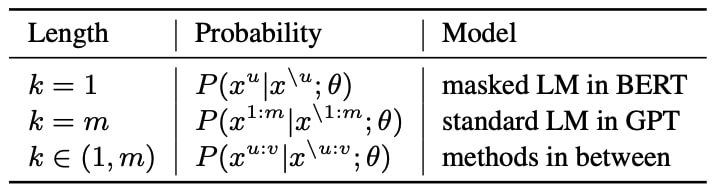

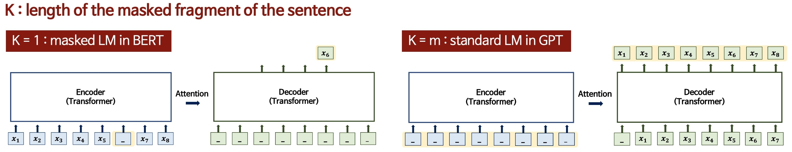

위에서 $k$라는 변수를 정의하였다. MASS는 masking된 token의 개수를 조절할 수 있다는 것을 강조하며 **$k$의 length에 따라 MASS 는 BERT와 GPT를 커버할 수 있는 방법론**임을 강조한다. (K를 조절하면 BERT와 GPT를 MASS의 special case로 볼 수 있기 때문이다 ! )

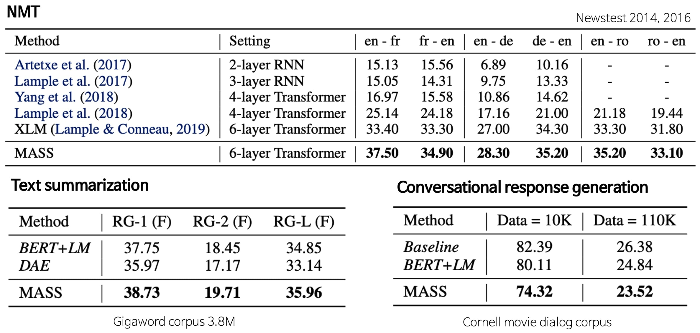

성능은 당연히 발표당시 굉장히 좋았고, Generation task에서 두각을 보였다

#### 2. BART

BART 모델은 GoldenPass 스터디를 함께하는 [대영]()님이 소개해주셔서 읽게되었다 ! 🤩

 *BART논문을 읽고나서 MASS를 읽을 때는 인식하지 못했는데, BART논문은 Objective function 에 대한 수식이 정리되어있지 않아서 아쉬웠다 (물론 논문을 읽으면 pretraining objective function은 denoising Autoencoding방식인것을 알 수 있다.) 하지만 실험적으로 여러가지 masking 방법을 적용했고 성능이 좋기 때문에 다른 연구에 많이 적용되었다. 실제로 MASS보다 2배정도 인용수가 높다.*

BART는 Facebook AI에서 제안한 모델로,  Bidirectional and Auto-Regressive Transformer가 모델의 이름의 풀네임이지만 논문 제목은 Denoising Sequence-to-Sequence Pre-training for Natural Language Generation, Translation, and Comprehension이다 (...🤔).  이 모델 또한 두가지 이름에서부터 몇가지 특징을 유추해 볼 수 있다.

1) 이 모델은 Sequence to Sequence구조를 가질것

2) 이 구조가 Bidirectional 과 Auto Regressive Transformer의 장점을 모두 갖출 것

3) Denoising이라는 단어가 등장한 것으로 보아 새로운 noise (MASK) 방법을 보일 것

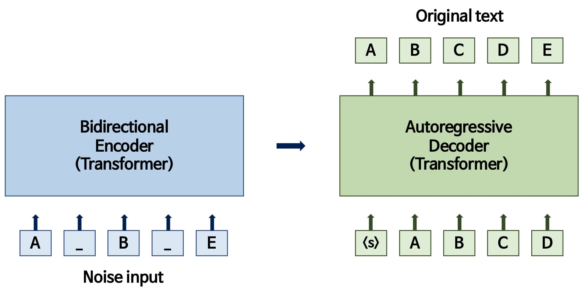

BART는 Seq2Seq 구조의 모델이며, bidirectional 구조를 만족하기위해 encoder에 masking을 진행했다. Encoder와 Decoder가 모두 transformer에 기반을 두고있으며 MASS와 달리 Encoder에서만 masking을 진행한다. 

BART의 구조를 보면 **BERT + GPT** 의 모습이라고 이해할 수 있는데, 실제로 논문에서도 다음과 같은 문구가 적혀있다. BERT와 GPT를 일반화하고 recent pretrainin scheme도 일반화가 가능하다고 주장한다. *(그렇기 때문에 더 objective function 수식으로 이를 설명했다면 좋았을 텐데 라는 생각이 든다)* 

> *It uses a standard Tranformer-based neural machine translation architecture which, despite its simplicity, can be seen as generalizing BERT (due to the bidirectional encoder), GPT (with the left-to-right decoder), and many other more recent pretraining schemes*

BART는 text generation task에서 좋은 성능을 보였으며 특히 새로운 finetuning 방법을 제안하였다는 것을 contribution으로 제시한다. 모델 구조를 간략히 짚은 후 contribution을 중심으로 정리해보려 한다.

####2.1 BART vs BERT vs GPT

BART의 Encoder, Decoder가 BERT , GPT와 각각 어떻게 다른지 살펴보자. 

#### 2.1.1 BERT vs BART

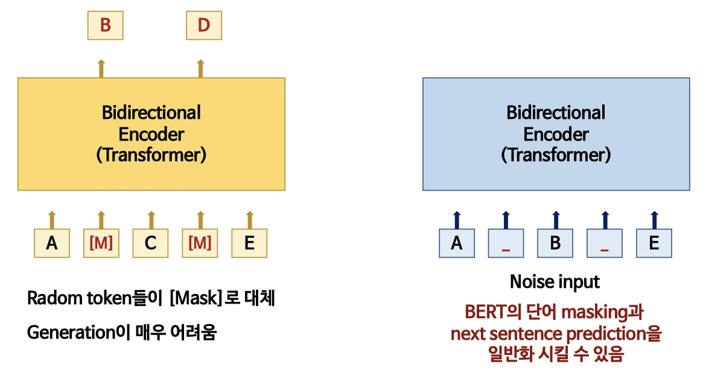

왼쪽은 BERT, 오른쪽은 BART 구조에 대한 그림이다. 먼저 BERT는 Encoder만으로 이루어진 모델이기 때문에 input token들이 들어가면 단일 모델에서 prediction을 진행한다. 하지만 BART는 Seq2Seq 구조이므로 Encoder를 통해 생성된 값이 Decoder로 전달되는 형태를 가진다.

BERT는  Random token들이 Mask로 대체되며 각  Masked token을 독립적으로 예측하는 형태로 pretrain이 진행된다. 이렇게 독립적으로 token을 예측하기 때문에 Generation이 어렵다는 단점을 가지고있다. 

반면에 BART는 여러가지 noising 방법을 시도하여 가장 좋은 방법을 찾아냈기 때문에 BERT의 단어 masking과 next sentence prediction을 일반화 시킬 수 있다는 장점을 가지고있다.

#### 2.1.2 GPT vs BART

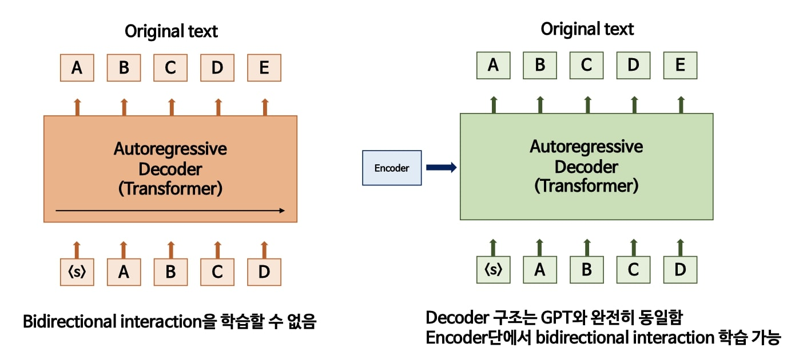

왼쪽은 GPT, 오른쪽은 BART 구조에 대한 그림이다. GPT는  Decoder만으로 이루어진 모델이며 Autoregressive한 형태로 학습이 된다. 따라서 Bidirectional interaction을 학습할 수 없다는 치명적인 단점을 가지고있다. BART의 Decoder 구조는 GPT와 완전히 동일하지만 Encoder단에서 bidirectional interaction을 학습할 수 있다.

#### 2.2 Pretraning BART

앞서 말한 것 같이 BART는 Encoder단에 여러가지 noise를 주어 학습을 진행한다. 따라서 noise를 첨가한 text를 원복으로 복원하는 방식으로 학습이 진행된다. 간략히 pretraining을 정리하면 아래와 같다

* Reconstruction loss는 Decoder output과 original text사이의 cross entropy
* 기존의 Denoising autoencoder와 달리, BART는 어떤 문서의 noise도 다룰 수 있음
  * 극단적으로 Input이 모두 손상되더라도 적용이 가능하다
    * 이 의미는 Encoder에서 모든 token이 손상되어도 Decoder의 인풋은 보존된 형태로 학습을 하기때문에 학습이 가능하다는 이야기이다. (아무것도 들어오지 않은 상태에서 문장을 생성해낼 수는 없다)
* GeLU을 사용하여 학습을 진행
* 초기 파라미터는 정규분포를 따른다 ($N \sim  (0,0.02)$)
* Base model은 encoder, decoder block 6개 / Large model은 12개씩 쌓음

#### 2.3 Noise 방법론

Noise 방법은 아래의 그림으로 정리해볼 수 있다.  처음에 이 방법을 한번에 학습한건가 생각했는데, 논문을 읽어보면 각각의 noise방법마다 실험을 진행했다고 한다. 

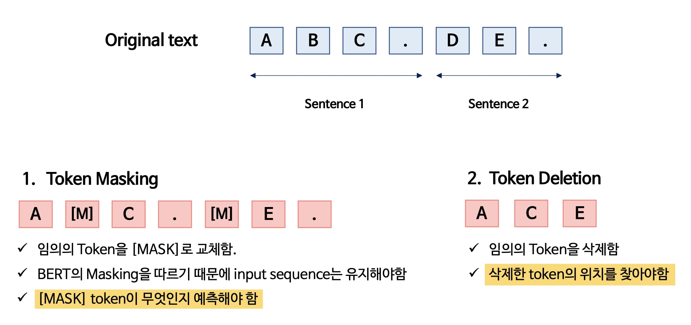

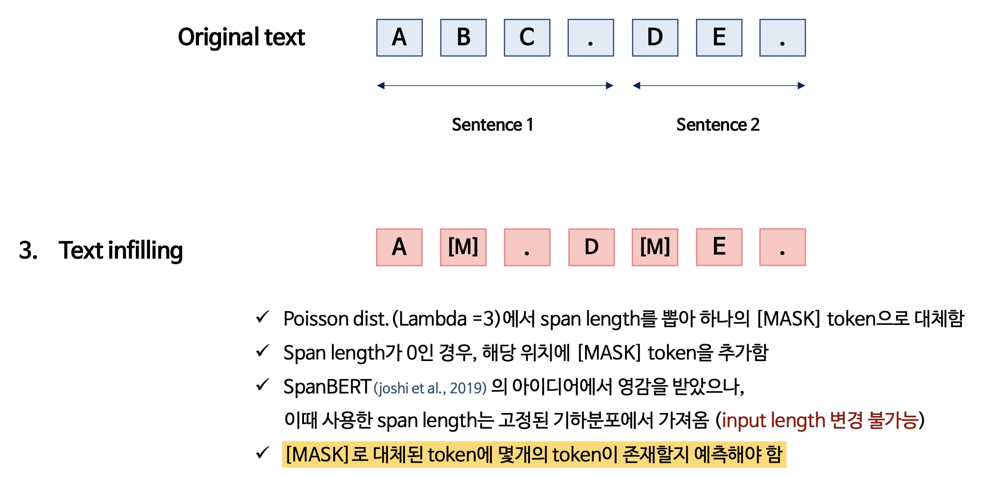

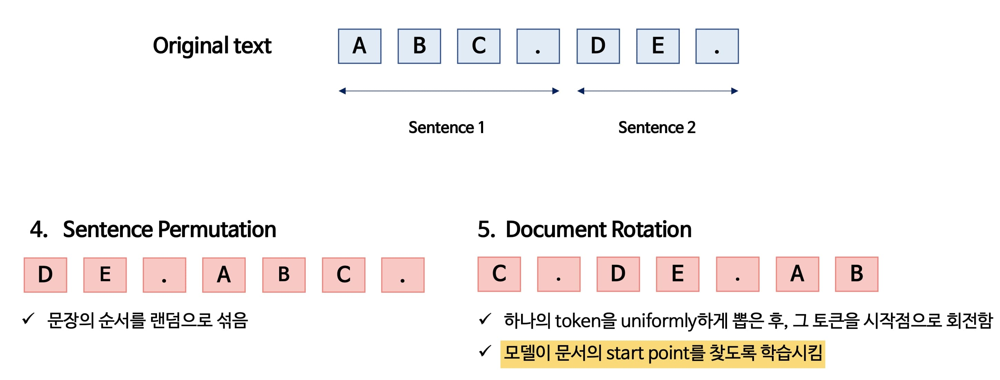

#### 2.4 Result

*Fintuning에 대한 설명이 따로 나와있는데, 여러가지 모델의 구조와 학습방법을 비교하고자 했기 때문에 이 부분은 이 포스팅에서 다루지는 않을 생각이다. 이 포스팅에서 다루지 않는 내용에 궁금하다면 아래의 BART 자료를 참고하면 될 것 같다.*

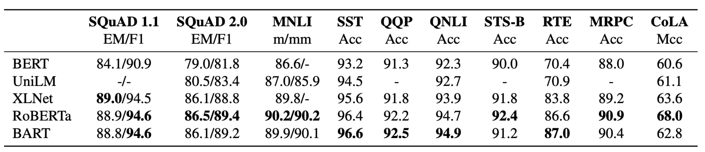

GLUE benchmark에 대한 성능은 다음과 같다. 역시나 성능이 좋고 RoBERTa와 비슷하거나 조금 더 좋다고 이해할 수 있다.

**BART는 공부하면서 따로 만들어둔 자료가 있다. 따라서 아래의 링크에서 자료(pdf)를 다운 받을 수 있다 **

 🌟 [BART link](https://drive.google.com/file/d/14593hoV6QH64GjO_498-MlOD2-usU1Sk/view?usp=sharing) 🌟

#### 3. MASS와 BART

두가지 모델은 Seq2Seq 구조에 masking방법을 다르게 설정하여 학습을 진행했다. MASS는 Decoder에도 Masked token을 사용했다. Encoder와 Decoder에 상반된 masking을 취함으로서 joint training을 했다는 것이 중요하다고 생각한다. 반면에 BART는 Encoder에만 Masked token을 사용했다. 하지만 굉장히 많은 noise 방법을 사용했기 때문에 이 자체로도 의미가 있다고 생각한다.

두가지 논문 중에서 뭐가 더 좋다고 하기는 어렵지만, 둘다 BERT의 MLM을 더 발전시킨 형태라 이해했다. 또한 BERT와 GPT 모델을 일반화 했다는것에서 비슷하면서도 다른 모델이었다. 두가지 모델의 Masking 형태를 비교하며 다시 논문을 정리하면서 굉장히 재미있었고, Transformer를 기본으로 한 모델이 어떤식으로 발전해 나가는지 확인할 수 있었다.

이미 연구실 세미나에서 진행했기 때문에 영상과 자료는 아래의 링크에서 확인할 수 있다.

> 유튜브 영상 : [LINK](https://youtu.be/v7diENO2mEA)
>
> 자료 : [LINK](http://dsba.korea.ac.kr/seminar/?mod=document&uid=247)
>
> pdf 자료가 연구실 홈페이지에 공개되어있지만 (감사하게도) 메일로 ppt 파일을 요청해주시는 분들이 있다.
>
> 따라서 ppt파일이 필요한 분들은 연구실에 기재되어있는 메일로 연락주시면 된다 🤩

[jekyll-docs]: http://jekyllrb.com/docs/home
[jekyll-gh]:   https://github.com/jekyll/jekyll
[jekyll-talk]: https://talk.jekyllrb.com/

